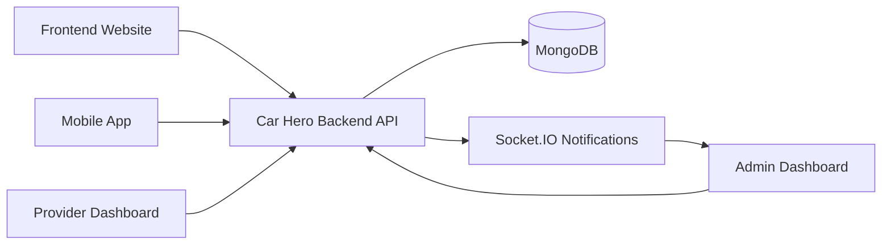
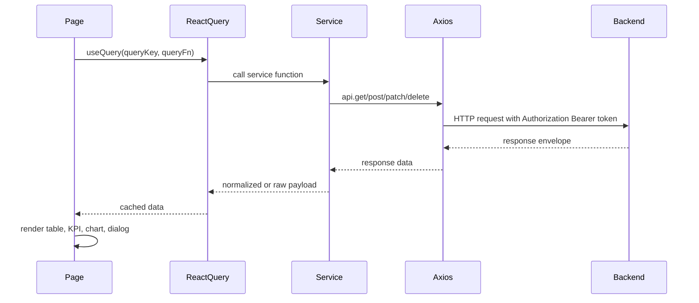
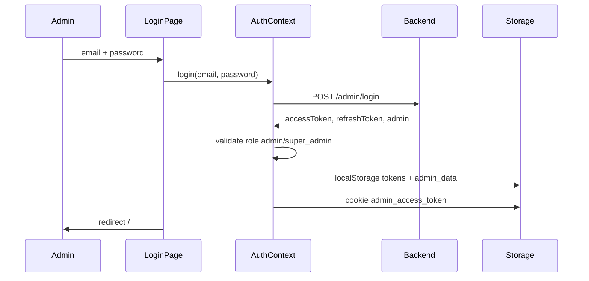
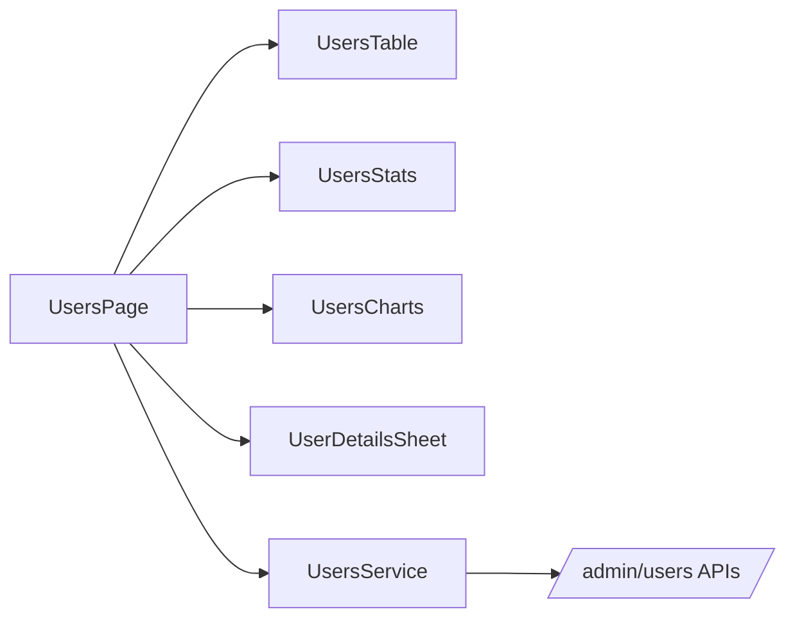
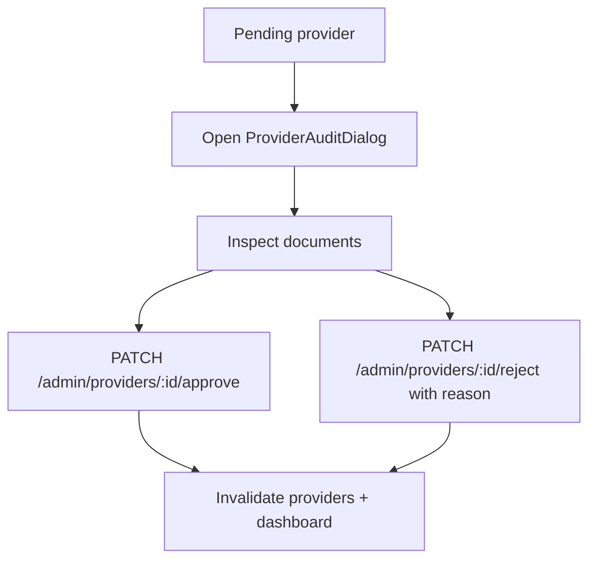
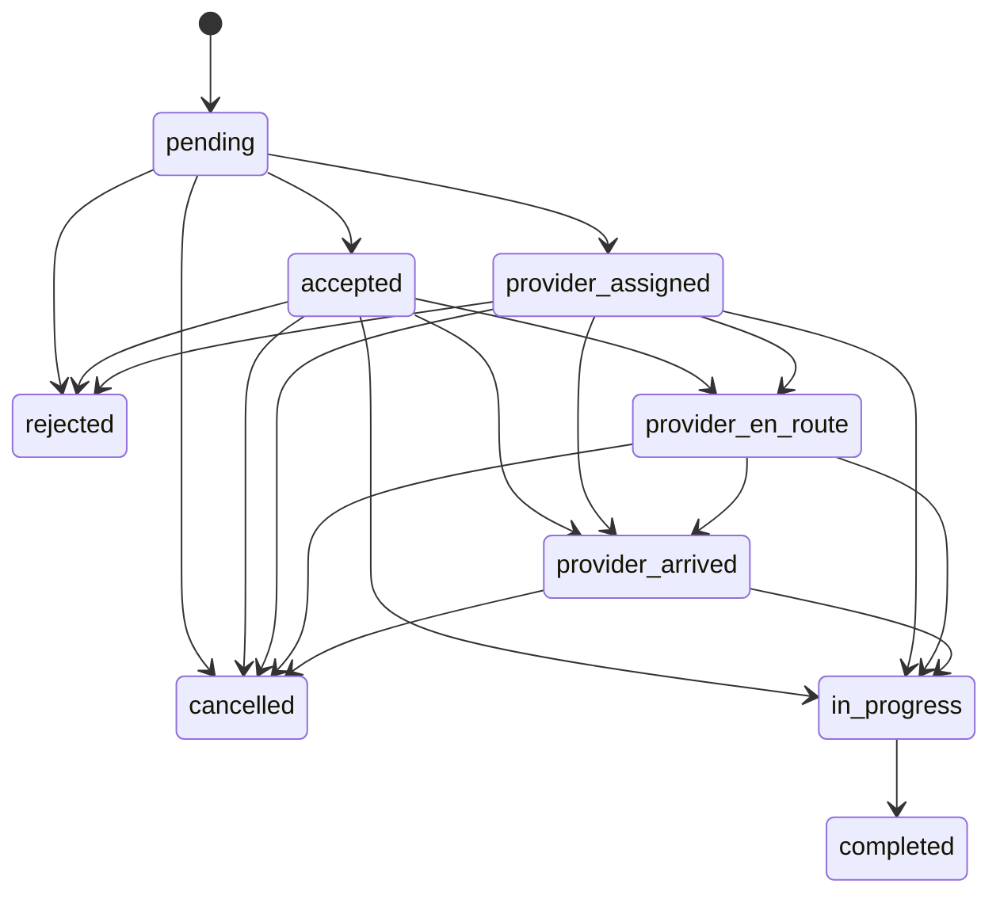
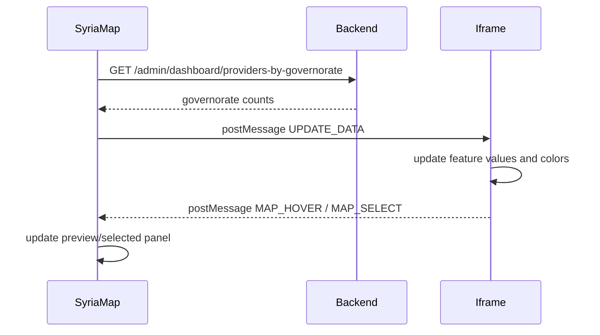

# CAR_HERO_ADMIN_DASHBOARD README

Complete technical, functional, architectural, and operational documentation for the Car Hero Admin Dashboard.

Last analyzed: 2026-06-20  
Project path: `car-hero-admin`

## Table Of Contents

1. [Dashboard Overview](#1-dashboard-overview)
2. [Technology Stack](#2-technology-stack)
3. [Project Structure](#3-project-structure)
4. [Dashboard Architecture](#4-dashboard-architecture)
5. [Authentication And Access Control](#5-authentication-and-access-control)
6. [Navigation System](#6-navigation-system)
7. [Pages Documentation](#7-pages-documentation)
8. [Dashboard KPIs](#8-dashboard-kpis)
9. [Analytics And Charts System](#9-analytics-and-charts-system)
10. [User Management Module](#10-user-management-module)
11. [Provider Management Module](#11-provider-management-module)
12. [Orders Management Module](#12-orders-management-module)
13. [Reviews And Ratings Module](#13-reviews-and-ratings-module)
14. [Subscription Management Module](#14-subscription-management-module)
15. [Financial And Revenue Monitoring](#15-financial-and-revenue-monitoring)
16. [Notifications And Messaging](#16-notifications-and-messaging)
17. [Reports Module](#17-reports-module)
18. [Excel Integration And Data Import](#18-excel-integration-and-data-import)
19. [Syria Map Module](#19-syria-map-module)
20. [API Integrations](#20-api-integrations)
21. [State Management](#21-state-management)
22. [Forms System](#22-forms-system)
23. [Search Filter And Sorting Systems](#23-search-filter-and-sorting-systems)
24. [Design System](#24-design-system)
25. [Performance Optimization](#25-performance-optimization)
26. [Error Handling](#26-error-handling)
27. [Environment Configuration](#27-environment-configuration)
28. [Security Considerations](#28-security-considerations)
29. [Complete Feature Inventory](#29-complete-feature-inventory)
30. [Administrator Guide](#30-administrator-guide)
31. [Known Limitations](#31-known-limitations)
32. [How CAR_HERO_ADMIN_DASHBOARD Works Internally](#32-how-car_hero_admin_dashboard-works-internally)

---

## 1. Dashboard Overview

`CAR_HERO_ADMIN_DASHBOARD` is the internal administration interface for the Car Hero platform. It is a Next.js web application used by administrators to observe platform health, manage customers and providers, audit provider onboarding, control orders and bookings, manage service catalog entries, monitor platform finance, manage subscriptions, moderate reviews, broadcast notifications, inspect audit logs, manage admin accounts, and review AI recommendation analytics.

### Purpose

The dashboard centralizes the operational control plane of Car Hero. It does not own business data directly and does not connect to MongoDB directly. Its job is to:

- Authenticate administrators.
- Consume backend admin APIs.
- Render operational dashboards, tables, charts, and maps.
- Trigger administrative actions through backend endpoints.
- Keep cached frontend data synchronized after important mutations.
- Display real-time notifications over Socket.IO.

### Business Goals

- Give operations staff a single view of providers, users, orders, bookings, subscriptions, revenue, reviews, notifications, and audit logs.
- Shorten provider approval and rejection workflows.
- Make financial and payout monitoring visible to admins.
- Provide CSV exports for operational review.
- Surface AI recommendation behavior for quality monitoring.
- Support admin-team permission and account management.

### Relationship With The Car Hero Ecosystem



- **Backend**: The dashboard depends on the backend for authentication, data, mutations, analytics, audit logs, wallet data, notifications, and AI recommendation metrics.
- **Website**: The website handles public discovery and customer/provider-facing flows. The admin dashboard monitors and manages the resulting platform data.
- **Mobile App**: Customers and providers likely create orders, reviews, and subscriptions through mobile flows. The admin dashboard observes and administers those records.
- **Provider Dashboard**: Provider operational actions are separate. Admins can inspect providers, approve/reject registration, update profiles, and monitor provider-related analytics.
- **Database**: MongoDB is accessed only through backend APIs. The dashboard never opens a database connection.

---

## 2. Technology Stack

| Technology | Where Used | Responsibility |
|---|---|---|
| Next.js `16.2.4` | `src/app`, `src/proxy.ts` | App Router, routing, layouts, metadata, route protection proxy, build/runtime framework. |
| React `19.2.4` | All pages and components | UI rendering, client-side state, component composition. |
| TypeScript `5` | `src/**/*.ts`, `src/**/*.tsx` | Static typing for domain entities, service filters, context contracts, and components. |
| Tailwind CSS `4` | `src/app/globals.css`, component classes | Theming, RTL layout styling, dashboard visual system, responsive styles. |
| `@base-ui/react` | `src/components/ui/*` | Accessible primitives used by local UI wrappers: buttons, dialogs, dropdowns, inputs, selects, tabs, sheets, switch, avatar, badge. |
| `lucide-react` | Layouts, pages, cards, buttons | Icon system for navigation, actions, KPI cards, empty states, and dialogs. |
| `@tanstack/react-query` | Pages and providers | Server-state fetching, caching, invalidation, retry behavior, polling header unread count. |
| Axios `1.16.0` | `src/infrastructure/api/client.ts` | HTTP client with auth header injection and refresh-token retry interceptor. |
| ECharts `6` and `echarts-for-react` | Analytics components | KPI charts, line/bar/pie/donut/radar/gauge visualizations. Loaded dynamically to avoid SSR chart rendering issues. |
| Socket.IO Client `4.8.3` | `use-socket.ts`, `admin-notification-provider.tsx` | Real-time admin notifications over `/notifications` namespace. |
| Sonner `2.0.7` | Mutations and global provider | Toast feedback for success, errors, warnings, and real-time notifications. |
| `date-fns` | Tables and feeds | Relative time and date formatting with Arabic locale. |
| `next-themes` | `src/components/ui/sonner.tsx` | Supplies current theme to Sonner. No full theme switcher was found in the dashboard. |
| `clsx` and `tailwind-merge` | `src/lib/utils.ts` | Class name composition and Tailwind conflict merging through `cn`. |
| `class-variance-authority` | UI primitives | Variant definitions in local UI components. |
| Vitest `4.1.9` | `src/infrastructure/services/__tests__` | Unit tests for critical service calls: login, order cancel/reject, payout action. |
| ESLint `9` and `eslint-config-next` | `eslint.config.mjs` | Linting with Next core web vitals and TypeScript rules. |
| Leaflet `1.9.4` via CDN | `public/maps/syria_choropleth.html` | Interactive Syria governorate map inside an iframe. |
| `@tanstack/react-table` | Installed dependency | Installed but no direct `useReactTable` usage was found in source. Tables are hand-built HTML tables. |

---

## 3. Project Structure

### Architecture Tree

```text
car-hero-admin/
  .env.local
  components.json
  eslint.config.mjs
  next.config.ts
  package.json
  postcss.config.mjs
  tsconfig.json
  vitest.config.ts
  public/
    logo_carHero.png
    maps/
      syria_choropleth.html
  src/
    app/
      layout.tsx
      globals.css
      error.tsx
      not-found.tsx
      login/page.tsx
      (dashboard)/
        layout.tsx
        page.tsx
        users/page.tsx
        providers/page.tsx
        orders/page.tsx
        bookings/page.tsx
        services/page.tsx
        finance/page.tsx
        subscriptions/page.tsx
        reviews/page.tsx
        notifications/page.tsx
        admins/page.tsx
        settings/page.tsx
        logs/page.tsx
        ai-recommendations/page.tsx
        */components/*.tsx
    application/
      contexts/auth-context.tsx
      hooks/use-socket.ts
    components/
      layout/header.tsx
      layout/sidebar.tsx
      providers/admin-notification-provider.tsx
      providers.tsx
      ui/*.tsx
    domain/
      entities/*.types.ts
    infrastructure/
      api/client.ts
      api/response.ts
      auth/admin-session.ts
      query/query-keys.ts
      services/*.service.ts
      services/__tests__/critical-services.test.ts
    lib/utils.ts
    proxy.ts
```

### Folder Responsibilities

| Folder/File | Responsibility |
|---|---|
| `src/app` | Next.js App Router pages, dashboard layouts, global CSS, error and 404 pages. |
| `src/app/(dashboard)` | Protected admin dashboard route group. Every page here renders inside the admin shell. |
| `src/app/(dashboard)/*/components` | Feature-specific UI components for tables, charts, dialogs, stats, and cards. |
| `src/application/contexts` | Client contexts, currently `AuthProvider`. |
| `src/application/hooks` | Client hooks, currently Socket.IO connection hook. |
| `src/components/layout` | Shell navigation: `Sidebar` and `Header`. |
| `src/components/providers.tsx` | Root client provider for React Query, auth, and Sonner toasts. |
| `src/components/providers/admin-notification-provider.tsx` | Real-time notification listener and cache invalidation handler. |
| `src/components/ui` | Local design-system primitives wrapping Base UI and Tailwind styles. |
| `src/domain/entities` | TypeScript interfaces for Admin, Provider, Booking, User, Service, Review, Subscription, Wallet, Notification, AuditLog. |
| `src/infrastructure/api` | Axios client, API envelope unwrapping, query param cleanup, error message extraction. |
| `src/infrastructure/auth` | Local storage and cookie session helpers. |
| `src/infrastructure/query` | Central query key factory. Used by several pages, but not yet consistently by every module. |
| `src/infrastructure/services` | HTTP service layer. Each file maps frontend calls to backend endpoints. |
| `src/proxy.ts` | Next route protection proxy based on `admin_access_token` cookie. |
| `public/maps/syria_choropleth.html` | Static Leaflet map that receives dynamic provider counts through `postMessage`. |

---

## 4. Dashboard Architecture

### Application Architecture

The dashboard follows a client-heavy App Router architecture:

1. `src/app/layout.tsx` sets `lang="ar"` and `dir="rtl"`, loads global styles, and wraps the app in `Providers`.
2. `src/components/providers.tsx` initializes React Query and `AuthProvider`.
3. `src/proxy.ts` performs a first route check using the browser cookie `admin_access_token`.
4. `src/app/(dashboard)/layout.tsx` performs a client-side auth check and renders the admin shell.
5. Feature pages call service functions from `src/infrastructure/services`.
6. Services call Axios `api`, which injects auth headers and handles token refresh.
7. Mutations invalidate query keys to keep tables, KPIs, and dashboards fresh.

```mermaid
flowchart TB
  RootLayout[src/app/layout.tsx] --> Providers[React Query + Auth + Toaster]
  Providers --> Proxy[src/proxy.ts cookie guard]
  Proxy --> DashboardLayout[(dashboard)/layout.tsx]
  DashboardLayout --> Sidebar
  DashboardLayout --> Header
  DashboardLayout --> Page[Feature Page]
  Page --> Service[infrastructure/services]
  Service --> Axios[api/client.ts]
  Axios --> Backend[Backend API]
  Backend --> Axios
  Axios --> ReactQuery[React Query Cache]
  ReactQuery --> Page
```

### Routing Architecture

- `/login` is outside the protected dashboard group.
- Dashboard pages live inside `src/app/(dashboard)` and use normal URL routes without the `(dashboard)` segment.
- `src/proxy.ts` redirects unauthenticated users to `/login`.
- The client dashboard layout redirects to `/login` if no admin is found in local storage after mount.

### Component Architecture

Components are split into:

- **Shell components**: `Sidebar`, `Header`, `AdminNotificationProvider`.
- **UI primitives**: `Button`, `Card`, `Dialog`, `DropdownMenu`, `Input`, `Select`, `Tabs`, `Sheet`, `Switch`, `StatCard`, `StatusBadge`, `Skeleton`.
- **Feature components**: Page-local tables, forms, charts, cards, dialogs.
- **Infrastructure services**: One service file per backend domain.

### Data Flow Architecture



---

## 5. Authentication And Access Control

### Login Flow

Route: `/login`  
File: `src/app/login/page.tsx`

1. Admin enters email and password.
2. Email is trimmed and lowercased.
3. `AuthProvider.login` calls `adminLogin`.
4. `adminLogin` posts to `POST /admin/login`.
5. Response is unwrapped by `unwrapApiData`.
6. The admin role must be `admin` or `super_admin`.
7. Access token, refresh token, and admin payload are stored in local storage.
8. A non-HttpOnly cookie named `admin_access_token` is written for route protection.
9. User is redirected to `/`.



### Session Management

File: `src/infrastructure/auth/admin-session.ts`

Stored keys:

- `admin_access_token`
- `admin_refresh_token`
- `admin_data`

Cookie:

- Name: `admin_access_token`
- Max age: 7 days
- `SameSite=Lax`
- `Secure` only when current page protocol is HTTPS
- Not HttpOnly because it is written from client JavaScript.

### Refresh Token Interceptor

File: `src/infrastructure/api/client.ts`

The Axios response interceptor handles `401` as follows:

1. Ignores auth endpoints: `/admin/login`, `/admin/refresh-token`, `/admin/logout`.
2. If a request has not already been retried, it calls `POST /admin/refresh-token` using raw Axios.
3. A shared `refreshRequest` promise prevents multiple simultaneous refresh requests.
4. New access and refresh tokens are stored.
5. The failed request is retried with the new access token.
6. If refresh fails, local session is cleared and the browser redirects to `/login`.

### Route Protection

File: `src/proxy.ts`

- If route is not `/login` and cookie `admin_access_token` does not exist, redirect to `/login`.
- If route is `/login` and token exists, redirect to `/`.
- The matcher excludes API routes, static assets, Next image assets, and favicon.

### Authorization

Global page authorization is mostly session-based. The only page with explicit frontend permission checks is `/admins`.

Admin page permissions include:

- `admins.read`
- `admins.create`
- `admins.update`
- `admins.delete`
- `*`
- `all`

Other modules rely on backend authorization and do not hide UI actions by permission in the current frontend implementation.

---

## 6. Navigation System

### Sidebar Groups

File: `src/components/layout/sidebar.tsx`

| Group | Routes |
|---|---|
| Main | `/` |
| Member Management | `/users`, `/providers` |
| Operations | `/orders`, `/bookings`, `/services` |
| Finance | `/finance`, `/subscriptions` |
| Quality | `/reviews`, `/notifications` |
| System | `/admins`, `/settings`, `/logs`, `/ai-recommendations` |

Sidebar capabilities:

- RTL navigation.
- Active route highlighting.
- Mobile overlay.
- Collapsed mode.
- Admin profile display.
- Logout action.
- Icon-based navigation with Lucide icons.

### Header

File: `src/components/layout/header.tsx`

Header capabilities:

- Displays route title from an internal map.
- Shows unread notification count from `GET /notifications/unread-count`.
- Polls unread notifications every 10 seconds.
- Provides quick command/search dialog with `Ctrl+K` or `Cmd+K`.
- Quick links: providers, orders, notifications.

Known gap: `/ai-recommendations` is not included in the header title map, so it falls back to the default dashboard title.

---

## 7. Pages Documentation

### Page Inventory

| Page | Route | File |
|---|---|---|
| Login | `/login` | `src/app/login/page.tsx` |
| Overview Dashboard | `/` | `src/app/(dashboard)/page.tsx` |
| Providers | `/providers` | `src/app/(dashboard)/providers/page.tsx` |
| Users | `/users` | `src/app/(dashboard)/users/page.tsx` |
| Orders | `/orders` | `src/app/(dashboard)/orders/page.tsx` |
| Bookings | `/bookings` | `src/app/(dashboard)/bookings/page.tsx` |
| Services | `/services` | `src/app/(dashboard)/services/page.tsx` |
| Finance | `/finance` | `src/app/(dashboard)/finance/page.tsx` |
| Subscriptions | `/subscriptions` | `src/app/(dashboard)/subscriptions/page.tsx` |
| Reviews | `/reviews` | `src/app/(dashboard)/reviews/page.tsx` |
| Notifications | `/notifications` | `src/app/(dashboard)/notifications/page.tsx` |
| Admins | `/admins` | `src/app/(dashboard)/admins/page.tsx` |
| Settings | `/settings` | `src/app/(dashboard)/settings/page.tsx` |
| Logs | `/logs` | `src/app/(dashboard)/logs/page.tsx` |
| AI Recommendations | `/ai-recommendations` | `src/app/(dashboard)/ai-recommendations/page.tsx` |
| Error Boundary | App-wide | `src/app/error.tsx` |
| Not Found | App-wide | `src/app/not-found.tsx` |

### `/login`

Purpose: authenticate admins.

APIs:

- `POST /admin/login`

Business logic:

- Normalizes email to lowercase.
- Requires backend response to contain access token, refresh token, and admin.
- Requires role `admin` or `super_admin`.
- Redirects authenticated admins to `/`.

User interactions:

- Email input.
- Password input.
- Password visibility toggle.
- Submit login.
- Success/error toast.

### `/`

Purpose: high-level platform overview.

Components:

- `OverviewStatsRow`
- `OverviewGrowthChart`
- `OverviewGovChart`
- `SyriaMap`
- `OverviewCategoryChart`
- `OverviewCitiesTable`
- `OverviewBookingsFeed`

APIs:

- `GET /admin/dashboard/summary`
- `GET /admin/dashboard/providers-by-governorate`
- `GET /admin/dashboard/providers-by-service`
- `GET /admin/dashboard/providers-growth`
- `GET /admin/dashboard/top-cities`
- `GET /admin/wallet/stats`
- `GET /bookings`

Business logic:

- Builds KPIs from providers, users, orders, revenue, and wallet balance.
- Recent bookings refetch every 10 seconds.
- Charts use backend aggregated data.

User interactions:

- Read-only overview.
- Interactive map hover/click through iframe events.

### `/providers`

Purpose: provider management, auditing, profile editing, status filtering, and provider analytics.

Components:

- `ProvidersTable`
- `ProviderAuditDialog`
- `ProviderEditDialog`
- `ProvidersKpiCards`
- `ProvidersStats`

APIs:

- `GET /admin/providers`
- `GET /admin/dashboard/excel-summary`
- `PATCH /admin/providers/:id/approve`
- `PATCH /admin/providers/:id/reject`
- `PATCH /admin/providers/:id`

Business logic:

- Main status tabs: approved, pending, rejected.
- Advanced filters: account active state, runtime status, city, service, emergency flag, minimum rating, sort field, sort direction.
- Approve/reject invalidates providers and dashboard queries.
- Toggle active updates `isActive` and `accountStatus`.
- CSV export exports the current page.
- Provider audit dialog lets admins inspect uploaded documents, zoom, rotate, reset view, approve, or reject with reason templates.

User interactions:

- Search providers.
- Filter providers.
- Switch between list and stats views.
- Open audit dialog.
- Approve provider.
- Reject provider with reason.
- Edit provider profile.
- Toggle provider activation.
- Paginate.
- Export current page CSV.

### `/users`

Purpose: customer management, customer analytics, and account status control.

Components:

- `UsersStats`
- `UsersCharts`
- `UsersTable`
- `UserDetailsSheet`

APIs:

- `GET /admin/users`
- `GET /admin/users/:id`
- `PATCH /admin/users/:id/status`
- `DELETE /admin/users/:id`
- `GET /admin/stats/users-analytics`

Business logic:

- Filters by active/inactive, premium/standard, subscription status, plan tier, wallet balance range, sort field, and sort order.
- Customer details are fetched only when a user is selected.
- Delete uses browser `confirm`.
- CSV export fetches up to 100 filtered users and exports customer fields.

User interactions:

- Search by name or phone.
- Filter and sort users.
- View user details.
- Activate/deactivate user.
- Delete user.
- Export users CSV.
- Paginate.

### `/orders`

Purpose: admin order monitoring and order status control.

APIs:

- `GET /orders`
- `PATCH /orders/:id/status`
- `POST /orders/:id/cancel`
- `DELETE /orders/:id`

Business logic:

- Statuses displayed: pending, accepted, provider_assigned, provider_en_route, provider_arrived, in_progress, completed, cancelled, rejected.
- Local allowed transitions:
  - `pending` -> `accepted`, `provider_assigned`, `cancelled`, `rejected`
  - `accepted` -> `provider_en_route`, `provider_arrived`, `in_progress`, `cancelled`, `rejected`
  - `provider_assigned` -> `provider_en_route`, `provider_arrived`, `in_progress`, `cancelled`, `rejected`
  - `provider_en_route` -> `provider_arrived`, `in_progress`, `cancelled`
  - `provider_arrived` -> `in_progress`, `cancelled`
  - `in_progress` -> `completed`
- Cancellation calls `POST /orders/:id/cancel` with `{ reason, cancelledBy: "admin" }`.
- Rejection calls `PATCH /orders/:id/status` with `{ status: "rejected", reason, cancelledBy: "admin" }`.
- Cancellation and rejection require a reason of at least 5 trimmed characters.
- Mutations invalidate orders, bookings, and dashboard caches.

User interactions:

- Status KPI filters.
- Search by order number, customer, phone, provider, or service.
- Filter by status, payment status, payment method, scheduled flag, date range, amount range.
- Sort by created date, scheduled date, amount, status, order number.
- View details dialog.
- Run valid status transitions.
- Cancel/reject with reason.
- Delete order.
- Export current page CSV.
- Paginate.

### `/bookings`

Purpose: booking-oriented view over bookings/orders.

Components:

- `BookingsStats`
- `BookingsTable`
- `BookingDetailsDialog`

APIs:

- `GET /bookings`
- `GET /admin/stats/bookings-analytics`
- `PATCH /orders/:id/status`
- `POST /orders/:id/cancel`
- `DELETE /orders/:id`

Business logic:

- Uses booking status cards and weekly/service breakdown charts.
- Accepts pending bookings.
- Cancels pending or accepted bookings through the reasoned cancel endpoint.
- Delete calls the same service delete function used for orders.
- Mutations invalidate bookings, orders, and dashboard caches.

User interactions:

- Search booking number, customer, or service.
- Filter by booking status.
- View booking timeline/details.
- Accept booking.
- Cancel booking with reason.
- Delete booking.
- Paginate.

### `/services`

Purpose: manage the service catalog.

Components:

- `ServicesList`
- `ServiceDialog`
- `ServicesStats`

APIs:

- `GET /admin/services`
- `POST /admin/services`
- `PATCH /admin/services/:id`
- `DELETE /admin/services/:id`

Business logic:

- Service categories include roadside assistance, towing, battery, tire, fuel, lockout, maintenance, car wash, and other.
- Service dialog validates names, non-negative prices, discounted price not greater than base price, and duration at least 1 minute.
- Local pricing estimator:
  - `fuelComponent = fuelRate * 1.5`
  - `timeComponent = estimatedDuration * 1200 * difficulty`
  - `recommendedPrice = rawEstimate * 1.25` for emergency services, otherwise `rawEstimate`
- Delete confirmation says service is stopped/hidden while order records are preserved.
- CSV export exports current filtered service list.

User interactions:

- Search services.
- Filter by category, active state, emergency state.
- Sort by sort order, name, price, duration, usage, revenue.
- Add service.
- Edit service.
- Toggle active state.
- Delete service.
- View stats.
- Export CSV.

### `/finance`

Purpose: monitor wallet, transactions, revenue flow, and provider payout requests.

Components:

- `FinanceStats`
- `FinanceCharts`
- `TransactionsTable`
- `PayoutRequests`

APIs:

- `GET /admin/wallet/stats`
- `GET /admin/wallet/transactions/all`
- `PATCH /admin/wallet/payouts/:id`

Business logic:

- Tabs: overview, flow, transactions, payouts.
- Transaction filters include search, type, status, owner type, reference type, date range, amount range, sort field, sort order.
- Payout requests are fetched from transactions with `type=debit`, `ownerType=provider`, and `referenceType=payout,withdrawal`.
- Payout approval action sends `action: "complete"` and note `تم التحويل من لوحة الإدارة`.
- Payout rejection action sends `action: "reject"` and note `تم الرفض من لوحة الإدارة`.
- Finance charts calculate revenue, commissions, and payouts from completed transaction rows.

User interactions:

- Switch finance tabs.
- Filter transactions.
- Export transactions CSV.
- Export payouts CSV.
- Approve payout.
- Reject payout.
- Paginate transactions and payouts.

### `/subscriptions`

Purpose: manage subscription plans and monitor subscribers.

Components:

- `SubscriptionAnalytics`
- `PlansList`
- `SubscribersTable`
- `PlanFormDialog`
- `PlanDeleteDialog`

APIs:

- `GET /admin/subscription-plans`
- `POST /admin/subscription-plans`
- `PATCH /admin/subscription-plans/:id`
- `DELETE /admin/subscription-plans/:id`
- `GET /admin/subscriptions`
- `GET /admin/memberships/stats`

Business logic:

- Tabs: overview and subscribers.
- Plan form fields: Arabic name, English name, price, duration days, tier, Arabic features, English features, active flag.
- Save validation is in page logic: name/nameAr required, price non-negative, duration days at least 1.
- Features are transformed from newline text to arrays.
- Plans can be basic, silver, gold, platinum.
- Delete confirmation disables/removes plan through backend while preserving subscriber records according to UI copy.
- Subscriber CSV export includes subscriber, phone, plan, status, amount paid, auto renew, start, end.

User interactions:

- Create plan.
- Edit plan.
- Delete active plan.
- View subscriber list.
- Filter subscribers by search, status, plan, date range.
- Sort subscribers.
- Export subscribers CSV.
- Paginate subscribers.

### `/reviews`

Purpose: review moderation and rating analytics.

Components:

- `ReviewsStats`
- `ReviewsList`
- `DeleteConfirmDialog`

APIs:

- `GET /reviews`
- `GET /reviews/stats`
- `PATCH /reviews/:id`
- `DELETE /reviews/:id`

Business logic:

- Filters: search, reported flag, visibility flag, rating, has response, sort field, sort direction.
- Visibility toggle sends `{ isVisible }`.
- Delete removes the review through backend.
- CSV export exports currently loaded reviews.

User interactions:

- Search reviews.
- Filter reported/visible/rating/response.
- Hide or show review.
- Delete review.
- Export CSV.
- Paginate.

### `/notifications`

Purpose: create admin notification campaigns and review campaign history.

APIs:

- `POST /notifications/admin/broadcast`
- `GET /notifications/admin/history`
- `GET /notifications/admin/stats`
- `GET /notifications/unread-count`

Business logic:

- Campaign audience: all, users, premium, providers.
- Campaign types: info, alert, system_alert, reminder.
- Send modes: immediate or scheduled.
- Title and body are required.
- Body max length is 500 characters.
- Scheduled campaigns require a future datetime.
- Campaign history can be searched and filtered by audience, status, and type.

User interactions:

- Compose campaign.
- Choose audience, type, and send time.
- Schedule campaign.
- Send campaign now.
- Filter campaign history.
- Paginate history.

### `/settings`

Purpose: manage platform operational settings.

APIs:

- `GET /admin/settings`
- `PATCH /admin/settings`
- `PATCH /admin/settings/maintenance`

Business logic:

- Settings form fields: appName, appVersion, contactEmail, contactPhone, commissionRate, minWithdrawalAmount, defaultCurrency.
- `appVersion` is displayed but disabled.
- Valid save requires non-empty appName, valid email containing `@`, commission rate between 0 and 1, and non-negative minimum withdrawal amount.
- Finance tab displays commission as percent but stores it as decimal.
- Maintenance mode can be toggled with Arabic and English maintenance messages.

User interactions:

- Edit platform settings.
- Edit finance settings.
- Toggle maintenance mode.
- Save settings.

### `/logs`

Purpose: audit log search, inspection, related-activity drilldown, and CSV export.

Components:

- `LogsStats`
- `LogsTable`
- `LogDetailsSheet`

APIs:

- `GET /admin/audit-logs`
- `GET /admin/audit-logs/stats`
- `GET /admin/audit-logs/export`
- `GET /admin/audit-logs/entity/:entityType/:entityId`

Business logic:

- Uses `useDeferredValue` for search input.
- Filters by action, entity type, search text, date range, and sort order.
- Export calls backend export endpoint and downloads returned CSV.
- Details sheet shows before/after/metadata JSON and fetches related logs for the same entity.

User interactions:

- Search logs.
- Filter by action/entity/date.
- Sort oldest/newest.
- Export CSV.
- View log details.
- Open related log records.
- Paginate.

### `/admins`

Purpose: manage admin accounts and permissions.

Components:

- `AdminsTable`
- `AdminFormDialog`
- `AdminDeleteDialog`
- Password reset dialog

APIs:

- `GET /admin/list`
- `POST /admin/create`
- `PATCH /admin/:id/permissions`
- `PATCH /admin/:id/status`
- `PATCH /admin/:id/password`
- `DELETE /admin/:id`

Business logic:

- Frontend permission gate requires `admins.read` or `*` or `all`.
- Create button requires `admins.create`.
- Edit, password reset, and status toggle require `admins.update`.
- Delete requires `admins.delete`.
- Current admin cannot reset own password, disable own account, or delete own account from the UI.
- Create form requires name, email, and password of at least 8 characters.
- Password reset dialog disables submit when password length is below 8. UI text also states password should include uppercase, lowercase, and number, but only length is checked in the frontend.

User interactions:

- Filter admins by search, status, permission.
- Create admin.
- Edit permissions.
- Reset password.
- Enable/disable admin account.
- Delete admin.

### `/ai-recommendations`

Purpose: observe AI provider recommendation quality, model usage, confidence, service/city performance, logs, exports, and retraining.

Components:

- `AiKpiCards`
- `AiModelDist`
- `AiConfidenceTrend`
- `AiDailyTrend`
- `AiServicePerformance`
- `AiCityPerformance`
- `AiTopProviders`
- Recommendation logs table

APIs:

- `GET /admin/ai-recommendations/summary`
- `GET /admin/ai-recommendations/top-providers`
- `GET /admin/ai-recommendations/service-performance`
- `GET /admin/ai-recommendations/city-performance`
- `GET /admin/ai-recommendations/filters`
- `GET /admin/ai-recommendations/logs`
- `GET /admin/ai-recommendations/export`
- `POST /admin/ai-recommendations/retrain`

Business logic:

- Filters: period, city, service category, model type, status.
- Logs have additional search and pagination.
- Export downloads a CSV blob from backend.
- Retrain mutation displays a warning if backend message includes `reload request failed`; otherwise displays success.

User interactions:

- Filter AI analytics.
- Reset filters.
- Refresh analytics and logs.
- Export CSV.
- Trigger retraining.
- Search recommendation logs.
- Paginate logs.

### Error And Not Found Pages

`src/app/error.tsx`:

- Client error boundary.
- Logs error to console.
- Shows error message if available.
- Offers retry and home actions.

`src/app/not-found.tsx`:

- 404 page.
- Offers return to home.

---

## 8. Dashboard KPIs

### Overview KPIs

Source: `src/app/(dashboard)/page.tsx`, `OverviewStatsRow`.

| KPI | Data Source | Meaning |
|---|---|---|
| Total providers | `summary.providers.total` | Total providers known to backend. |
| Approved providers | `summary.providers.approved` | Providers accepted for operation. |
| Pending providers | `summary.providers.pending` | Providers waiting for admin review. |
| Rejected providers | `summary.providers.rejected` | Provider applications rejected. |
| Total users | `summary.users.total` | Customer count. |
| Total orders | `summary.orders.total` | Total platform orders. |
| Total revenue | `summary.revenue.total` | Revenue reported by backend dashboard summary. |
| Platform balance | `wallet.data.balance` or `wallet.balance` | Current platform wallet balance. |

### Module KPIs

| Module | KPIs |
|---|---|
| Providers | Total, approved, pending, rejected, emergency providers, verified providers, city/service coverage, working-hour coverage, approval ratio. |
| Users | Total users, premium users, active users, monthly growth, loyalty levels. |
| Bookings | Status counts, weekly completed/pending/cancelled trend, service breakdown. |
| Services | Total services, active/inactive, emergency services, category distribution, service usage/revenue. |
| Finance | Platform balance, total commission earned, processed payouts, pending payout amount/count, transaction count. |
| Subscriptions | Plan statistics and membership/subscriber analytics from backend stats. |
| Reviews | Review count and rating distribution from backend stats. |
| Notifications | Total notifications, unread, sent, scheduled. |
| Logs | Total logs and grouped action/entity stats from audit log stats. |
| Admins | Total admins, active, inactive, managers. |
| AI Recommendations | Total recommendations, success rate, average confidence, failed recommendations. |

---

## 9. Analytics And Charts System

Charts use `echarts-for-react` with dynamic import and `ssr: false`.

| Chart | Component | Type | Data Source | Logic |
|---|---|---|---|---|
| Provider growth | `OverviewGrowthChart` | Line + bar | `/admin/dashboard/providers-growth` | Monthly provider counts plus cumulative total. |
| Governorate distribution | `OverviewGovChart` | Donut | `/admin/dashboard/providers-by-governorate` | Provider counts per governorate, top 8 list. |
| Provider service categories | `OverviewCategoryChart` | Bar | `/admin/dashboard/providers-by-service` | Top services/categories used by providers. |
| Syria coverage map | `SyriaMap` + iframe | Leaflet choropleth | `/admin/dashboard/providers-by-governorate` | Sends counts to iframe and colors governorates by density. |
| Recent bookings feed | `OverviewBookingsFeed` | Feed | `/bookings` | Shows latest 5 bookings with amount and status. |
| User signups | `UsersCharts` | Line | `/admin/stats/users-analytics` | Monthly customer growth. Single month is padded with previous month zero. |
| User loyalty levels | `UsersCharts` | Donut | `/admin/stats/users-analytics` | Groups customers by loyalty level. |
| Booking weekly trend | `BookingsStats` | Bar + line | `/admin/stats/bookings-analytics` or current bookings | Completed/pending/cancelled by weekday. |
| Booking services | `BookingsStats` | Donut | `/admin/stats/bookings-analytics` or current bookings | Service breakdown. |
| Provider advanced stats | `ProvidersStats` | Bar, donut, radar, gauge | `/admin/dashboard/excel-summary` | City, emergency, verified, performance, approval, working hours. |
| Service category distribution | `ServicesStats` | Chart | `/admin/services` facets | Service categories. |
| Service usage | `ServicesStats` | Chart | `/admin/services` facets | Service usage/revenue metrics. |
| Finance overview | `FinanceCharts` | Lines + bar | `/admin/wallet/transactions/all` | Revenue, platform commissions, provider payouts. |
| Finance flow | `FinanceCharts` | Stacked bars | `/admin/wallet/transactions/all` | Commissions versus payouts. |
| Subscription analytics | `SubscriptionAnalytics` | ECharts | `/admin/memberships/stats` | Subscriber/plan distribution according to backend stats. |
| Review stats | `ReviewsStats` | ECharts | `/reviews/stats` | Rating distribution. |
| AI model distribution | `AiModelDist` | Distribution cards/list | `/admin/ai-recommendations/summary` | Model usage counts. |
| AI confidence trend | `AiConfidenceTrend` | Line | `/admin/ai-recommendations/summary` | Average confidence over time. |
| AI daily trend | `AiDailyTrend` | Chart | `/admin/ai-recommendations/summary` | Success/failed daily recommendation counts. |
| AI service performance | `AiServicePerformance` | Chart | `/admin/ai-recommendations/service-performance` | Success/failed by service category. |
| AI city performance | `AiCityPerformance` | Chart | `/admin/ai-recommendations/city-performance` | Request volume by city. |
| AI top providers | `AiTopProviders` | Table/cards | `/admin/ai-recommendations/top-providers` | Highest performing recommended providers. |

---

## 10. User Management Module

### Capabilities

- List customers.
- Search by name or phone.
- Filter active/inactive users.
- Filter premium/standard.
- Filter subscription status: active, expired, cancelled, none.
- Filter by plan tier: basic, silver, gold, premium, vip.
- Filter by wallet balance min/max.
- Sort by newest, name, balance, loyalty, subscription end, last login.
- View detail sheet.
- Activate/deactivate account.
- Delete account.
- Export CSV.

### Data Flow



### Backend Dependencies

- `GET /admin/users`
- `GET /admin/users/:id`
- `PATCH /admin/users/:id/status`
- `DELETE /admin/users/:id`
- `GET /admin/stats/users-analytics`

---

## 11. Provider Management Module

### Capabilities

- List approved, pending, and rejected providers.
- Search by provider fields.
- Advanced filters for account state, runtime state, city, service, emergency availability, rating, sorting.
- Audit pending providers.
- View documents with zoom/rotation controls.
- Approve provider.
- Reject provider with prebuilt or custom reason.
- Edit provider profile.
- Toggle provider activation.
- Export current page CSV.
- View provider analytics.

### Provider Edit Fields

- businessName
- ownerName
- phone
- email
- city
- governorate
- address
- description
- status: online, busy, offline
- accountStatus: active, suspended, pending
- isActive
- emergency247
- experienceYears
- techCount
- commissionRate

### Provider Approval Workflow



---

## 12. Orders Management Module

### Capabilities

- Monitor orders from backend `/orders`.
- View status counts and totals.
- Filter by order status, payment status, payment method, scheduled flag, date range, amount range.
- Search by order number, customer, phone, provider, service.
- Sort by created date, scheduled date, amount, status, or order number.
- View details.
- Advance status through local allowed transitions.
- Cancel with required reason.
- Reject with required reason.
- Delete order.
- Export current page CSV.

### Lifecycle Represented In UI



### Important Implementation Detail

The cancel and reject flows are separate:

- Cancel: `POST /orders/:id/cancel`
- Reject: `PATCH /orders/:id/status` with `status: "rejected"`

Both require a clear admin reason in the UI.

---

## 13. Reviews And Ratings Module

### Capabilities

- List reviews.
- Search reviews.
- Filter reported reviews.
- Filter visible/hidden reviews.
- Filter by rating.
- Filter by provider response presence.
- Sort by created date, rating, helpful count.
- Hide or show reviews.
- Delete reviews.
- Export CSV.
- Display provider responses and report reasons.

### Data Source

- `GET /reviews`
- `GET /reviews/stats`

### Moderation Actions

- `PATCH /reviews/:id` with `{ isVisible }`
- `DELETE /reviews/:id`

---

## 14. Subscription Management Module

### Capabilities

- View membership plan analytics.
- Create subscription plan.
- Edit subscription plan.
- Delete active plan.
- View subscribers.
- Filter subscribers by search, status, plan, date range.
- Sort subscribers.
- Export subscribers CSV.

### Plan Fields

- `name`
- `nameAr`
- `price`
- `durationDays`
- `tier`
- `features`
- `featuresAr`
- `isActive`

### Business Rules In Frontend

- `name` and `nameAr` are required.
- `price` must be >= 0.
- `durationDays` must be >= 1.
- Feature text areas are split by newlines into arrays.

---

## 15. Financial And Revenue Monitoring

### Capabilities

- View wallet stats.
- View revenue and flow charts.
- Search and filter transactions.
- Export transactions CSV.
- View payout requests.
- Approve payout.
- Reject payout.
- Export payouts CSV.

### Finance Calculations In `FinanceCharts`

Only completed transactions are included. Per day:

- User order payment: `type=debit`, `ownerType=user`, `referenceType=order` -> adds to revenue and gross commission basis.
- Provider order earning: `type=credit`, `ownerType=provider`, `referenceType=order` -> subtracts from commission basis.
- Provider payout: `type=debit`, `ownerType=provider`, `referenceType=payout` or `withdrawal` -> adds to payouts.
- Commission is clamped with `Math.max(commissions, 0)`.

### Payout Processing

Endpoint: `PATCH /admin/wallet/payouts/:id`

Request:

- Approve: `{ action: "complete", note: "تم التحويل من لوحة الإدارة" }`
- Reject: `{ action: "reject", note: "تم الرفض من لوحة الإدارة" }`

---

## 16. Notifications And Messaging

### In-App Notification Campaigns

Page: `/notifications`

Capabilities:

- Broadcast to all, users, premium users, or providers.
- Send now or schedule for a future datetime.
- Choose notification type: info, alert, system_alert, reminder.
- View history with filters.
- View notification stats.

Validation:

- Title required.
- Body required.
- Body <= 500 characters.
- Scheduled time must be in the future.

### Real-Time Notifications

Files:

- `src/application/hooks/use-socket.ts`
- `src/components/providers/admin-notification-provider.tsx`

Flow:

1. `useSocket` derives socket URL from `NEXT_PUBLIC_API_URL`.
2. Connects to `/notifications`.
3. Sends auth token as `Bearer <token>` in socket auth.
4. Emits `join_notifications` on connect.
5. Listens for `notification`.
6. Invalidates notification queries.
7. If notification type is `provider.registered`, invalidates providers and dashboard queries.
8. Displays Sonner toast and plays a short Web Audio chime.

---

## 17. Reports Module

No dedicated `/reports` route or reports page was found in the Admin Dashboard source.

Reporting-like capabilities currently exist through:

- Dashboard overview analytics.
- Provider Excel summary endpoint.
- Users CSV export.
- Providers CSV export.
- Orders CSV export.
- Services CSV export.
- Subscriptions CSV export.
- Reviews CSV export.
- Finance transaction and payout CSV export.
- Audit logs CSV export.
- AI recommendation logs CSV export.

Operationally, the closest reporting module is `/logs`, because it includes audit search, filtering, detail inspection, related entity history, and backend CSV export.

---

## 18. Excel Integration And Data Import

No Excel upload or data import UI was found in this dashboard.

Existing Excel-related integration:

- `GET /admin/dashboard/excel-summary`
- Used on `/providers`
- Consumed by provider analytics and pending provider count logic.

Existing export behavior:

- Most modules implement browser-generated CSV downloads using `Blob` and `URL.createObjectURL`.
- Audit logs and AI recommendations call backend export endpoints and download returned CSV/blob.

Conclusion: the current dashboard supports CSV exports and provider summary consumption, but does not implement Excel upload, import validation, or import synchronization UI.

---

## 19. Syria Map Module

Files:

- `src/components/ui/syria-map.tsx`
- `public/maps/syria_choropleth.html`

### Architecture

`SyriaMap` renders a `Card` with an information panel and an `iframe`. The iframe loads `/maps/syria_choropleth.html`, which is a static Leaflet map with embedded Syria governorate GeoJSON.

### Data Flow



### Map Logic

- Leaflet is loaded from `https://unpkg.com/leaflet@1.9.4`.
- Map interaction disables zoom, dragging, double click zoom, touch zoom, and attribution controls.
- `UPDATE_DATA` accepts an array or object.
- Governorates are matched by English or Arabic names, including variants such as `Rural Damascus` and `Rular Damascus`.
- Count > 0 marks a governorate as `active`; otherwise `coming_soon`.
- `getColor(value)` applies a purple density gradient from light to dark.
- Hover sends `MAP_HOVER`.
- Click sends `MAP_SELECT`.

Security note: `postMessage` currently uses target origin `"*"`.

---

## 20. API Integrations

### API Client Behavior

Base URL:

- `NEXT_PUBLIC_API_URL` if configured and not pointing to `localhost:3000`.
- Fallback: `http://localhost:3001/api/v1`.

Request interceptor:

- Adds `Authorization: Bearer <accessToken>` when token exists.

Response interceptor:

- Refreshes token on `401` and retries the original request.

Response handling:

- `unwrapApiData` unwraps nested backend envelopes with `data`, `success`, `timestamp`, or `message`.
- Some service files return raw `r.data`; pages then perform local unwrapping for flexible backend response shapes.

### Endpoint Inventory

| Method | Endpoint | Purpose | Request | Response Usage | Used By |
|---|---|---|---|---|---|
| POST | `/admin/login` | Admin login | `{ email, password }` | accessToken, refreshToken, admin | Login/Auth |
| POST | `/admin/logout` | Logout | Auth header | message | Auth |
| GET | `/admin/me` | Current admin profile | Auth header | admin | Auth service |
| POST | `/admin/refresh-token` | Refresh access token | `{ refreshToken }` | accessToken, refreshToken | Axios interceptor |
| GET | `/admin/dashboard/summary` | Dashboard summary | none | providers/users/orders/revenue summary | Overview |
| GET | `/admin/dashboard/providers-by-governorate` | Provider governorate counts | none | count list | Overview charts, Syria map |
| GET | `/admin/dashboard/providers-by-service` | Provider service counts | none | count list | Overview category chart |
| GET | `/admin/dashboard/providers-growth` | Monthly provider growth | `period` query | monthly counts | Overview growth chart |
| GET | `/admin/dashboard/top-cities` | Top cities | `limit` query | city counts | Overview cities table |
| GET | `/admin/dashboard/map/syria-providers` | Syria providers map | none | map data | stats service, not directly used in page read |
| GET | `/admin/dashboard/excel-summary` | Provider summary analytics | none | provider summary/facets | Providers |
| GET | `/admin/stats` | General stats | none | stats payload | stats service |
| GET | `/admin/stats/orders` | Order stats | none | order stats | stats service |
| GET | `/admin/stats/bookings-analytics` | Booking analytics | none | status/weekly/service analytics | Bookings |
| GET | `/admin/stats/revenue` | Monthly revenue | none | revenue data | stats service |
| GET | `/admin/stats/top-services` | Top services | none | service stats | stats service |
| GET | `/admin/providers` | List providers | filters, page, limit | providers, pagination, facets | Providers |
| GET | `/admin/providers/:id` | Provider detail | path id | provider | Provider service |
| PATCH | `/admin/providers/:id/approve` | Approve provider | path id | mutation result | Providers |
| PATCH | `/admin/providers/:id/reject` | Reject provider | `{ reason }` | mutation result | Providers |
| PATCH | `/admin/providers/:id` | Update provider | provider fields | updated provider/result | Providers |
| GET | `/admin/users` | List users | page, limit, filters | users, meta/pagination | Users |
| GET | `/admin/users/:id` | User details | path id | user detail | Users |
| PATCH | `/admin/users/:id/status` | Toggle user status | `{ isActive }` | mutation result | Users |
| DELETE | `/admin/users/:id` | Delete user | path id | mutation result | Users |
| GET | `/admin/users/search` | Search users | `query` | user list | users service |
| GET | `/admin/stats/users-analytics` | User analytics | none | active/premium/growth/loyalty | Users |
| GET | `/orders` | List orders | page, limit, status, filters | orders, pagination, facets | Orders |
| GET | `/bookings` | List bookings | page, limit, status, filters | bookings/orders, pagination | Bookings/Overview |
| GET | `/bookings/:id` | Booking detail | path id | booking | bookings service |
| PATCH | `/orders/:id/status` | Update order status | `{ status }` or rejection body | mutation result | Orders/Bookings |
| POST | `/orders/:id/cancel` | Cancel order/booking | `{ reason, cancelledBy: "admin" }` | mutation result | Orders/Bookings |
| DELETE | `/orders/:id` | Delete order | path id | mutation result | Orders/Bookings |
| GET | `/admin/services` | List services | filters, page, limit | services, facets | Services |
| POST | `/admin/services` | Create service | service payload | created service/result | Services |
| PATCH | `/admin/services/:id` | Update service | service payload | updated service/result | Services |
| DELETE | `/admin/services/:id` | Delete service | path id | mutation result | Services |
| GET | `/reviews` | List reviews | page, limit, filters | reviews, pagination | Reviews |
| GET | `/reviews/stats` | Review stats | none | rating stats | Reviews |
| PATCH | `/reviews/:id` | Toggle visibility | `{ isVisible }` | mutation result | Reviews |
| DELETE | `/reviews/:id` | Delete review | path id | mutation result | Reviews |
| GET | `/admin/subscription-plans` | List plans | none | plans | Subscriptions |
| POST | `/admin/subscription-plans` | Create plan | plan payload | result | Subscriptions |
| PATCH | `/admin/subscription-plans/:id` | Update plan | plan payload | result | Subscriptions |
| DELETE | `/admin/subscription-plans/:id` | Delete plan | path id | result | Subscriptions |
| GET | `/admin/subscriptions` | List subscribers | page, limit, filters | subscribers, pagination | Subscriptions |
| GET | `/admin/memberships/stats` | Membership stats | none | stats | Subscriptions |
| GET | `/admin/wallet/stats` | Platform wallet stats | none | wallet stats | Finance/Overview |
| GET | `/admin/wallet/transactions/all` | Transactions and payouts | page, limit, filters | transactions, pagination | Finance |
| PATCH | `/admin/wallet/payouts/:id` | Process payout | `{ action, note }` | result | Finance |
| POST | `/notifications/admin/broadcast` | Send/schedule campaign | audience, type, title, body, scheduledAt | delivery status, recipients | Notifications |
| GET | `/notifications/admin/history` | Campaign history | page, limit, filters | campaigns, pagination | Notifications |
| GET | `/notifications/admin/stats` | Notification stats | none | stats | Notifications |
| GET | `/notifications/unread-count` | Header unread count | none | unread count | Header |
| GET | `/admin/settings` | Load settings | none | app settings | Settings |
| PATCH | `/admin/settings` | Update settings | partial settings | updated settings | Settings |
| PATCH | `/admin/settings/maintenance` | Update maintenance | maintenance body | updated settings | Settings |
| GET | `/admin/audit-logs` | Audit log list | filters, pagination | logs, total, pages | Logs |
| GET | `/admin/audit-logs/stats` | Audit stats | none | action/entity stats | Logs |
| GET | `/admin/audit-logs/export` | Export audit logs | filters | csv, filename, exported, truncated | Logs |
| GET | `/admin/audit-logs/entity/:entityType/:entityId` | Related logs | page, limit | logs | Log details |
| GET | `/admin/list` | Admin list | filters | admins, stats | Admins |
| POST | `/admin/create` | Create admin | admin payload | result | Admins |
| PATCH | `/admin/:id/permissions` | Update permissions | `{ permissions }` | result | Admins |
| PATCH | `/admin/:id/status` | Toggle admin status | `{ isActive }` | result | Admins |
| PATCH | `/admin/:id/password` | Reset admin password | `{ password }` | result | Admins |
| DELETE | `/admin/:id` | Delete admin | path id | result | Admins |
| GET | `/admin/ai-recommendations/summary` | AI summary | filters | summary | AI Recommendations |
| GET | `/admin/ai-recommendations/top-providers` | AI top providers | filters, limit | providers | AI Recommendations |
| GET | `/admin/ai-recommendations/service-performance` | AI service performance | filters | service performance | AI Recommendations |
| GET | `/admin/ai-recommendations/city-performance` | AI city performance | filters | city performance | AI Recommendations |
| GET | `/admin/ai-recommendations/filters` | AI filter options | none | cities, categories, model types | AI Recommendations |
| GET | `/admin/ai-recommendations/logs` | AI logs | filters, page, limit | logs, pagination | AI Recommendations |
| GET | `/admin/ai-recommendations/export` | Export AI logs | filters | CSV blob | AI Recommendations |
| POST | `/admin/ai-recommendations/retrain` | Retrain model | none | result/message | AI Recommendations |

### Error Handling For APIs

- Auth failures trigger token refresh and retry.
- If refresh fails, the session is cleared and user is redirected to `/login`.
- Many mutations show `toast.success` or `toast.error`.
- `apiErrorMessage` extracts backend `message` or `error` payload when available.
- Several pages set `retry: false` or `retry: 1` depending on data criticality.

---

## 21. State Management

### Global State

- `AuthProvider` stores admin, token, login/logout functions.
- React Query stores server state.
- `AdminNotificationProvider` reacts to real-time notifications and invalidates caches.

### Local State

Every feature page uses local `useState` for:

- Filters.
- Search terms.
- Pagination.
- Dialog open/closed states.
- Selected records.
- Form drafts.

### Query Keys

Central query keys are defined in `src/infrastructure/query/query-keys.ts`.

Used consistently in:

- Dashboard
- Providers
- Users
- Orders
- Bookings
- Finance
- Notifications

Partially or not fully centralized in:

- Services, using `["admin-services"]`.
- Subscriptions, using raw keys like `["subscription-plans"]`.
- Reviews, using raw keys like `["admin-reviews"]`.
- Settings, using `["admin-settings"]`.
- Logs, using raw audit keys.
- Admins, using `["admin-list"]`.
- AI, using raw `["ai-recommendations", ...]` keys even though `queryKeys.ai` exists.

### Cache Invalidation

Important invalidations:

- Provider approve/reject/update -> providers + dashboard.
- Order status/cancel/reject -> orders + bookings + dashboard.
- Booking status/cancel -> bookings + orders + dashboard.
- Finance payout -> finance + dashboard.
- Notifications -> notifications.
- Real-time provider registration notification -> providers + dashboard.

---

## 22. Forms System

No form library such as React Hook Form, Formik, Zod, Yup, or similar was found in the application source. Forms are built with local state and manual validation.

| Form | Fields | Validation | Submit |
|---|---|---|---|
| Login | email, password | backend failure handling, role check after response | `POST /admin/login` |
| Provider rejection | rejection reason | non-empty in audit dialog | `PATCH /admin/providers/:id/reject` |
| Provider edit | business, owner, phone, email, city, status, account status, emergency, experience, commission | businessName and phone required | `PATCH /admin/providers/:id` |
| Order cancel/reject | reason | trimmed length >= 5 | `POST /orders/:id/cancel` or `PATCH /orders/:id/status` |
| Booking cancel | reason | trimmed length >= 5 | `POST /orders/:id/cancel` |
| Service dialog | names, category, prices, duration, descriptions, flags | names required, prices non-negative, discount <= base, duration >= 1 | create/update service |
| Subscription plan | names, price, duration, tier, features, active | names required, price >= 0, duration >= 1 | create/update plan |
| Notification campaign | audience, type, mode, scheduledAt, title, body | title/body required, body <= 500, scheduled date future | `POST /notifications/admin/broadcast` |
| Settings | appName, contact email, contact phone, commission, min withdrawal, currency | appName, email contains `@`, commission 0..1, min withdrawal >= 0 | settings endpoints |
| Maintenance | maintenance mode, Arabic/English messages | no strict frontend text requirement | `PATCH /admin/settings/maintenance` |
| Admin create | name, email, password, permissions | name/email required, password length >= 8 | `POST /admin/create` |
| Admin permissions | permissions | none besides selection | `PATCH /admin/:id/permissions` |
| Admin password reset | password | length >= 8 | `PATCH /admin/:id/password` |

---

## 23. Search Filter And Sorting Systems

| Module | Search | Filters | Sorting |
|---|---|---|---|
| Providers | search query | status, isActive, runtimeStatus, city, service, emergency, minRating | createdAt, businessName, rating, orders, completedOrders, revenue, city |
| Users | name/phone | active, premium, subscription status, plan, balance min/max | newest, name, balance, loyalty, subscriptionEnd, lastLogin |
| Orders | order/customer/phone/provider/service | status, paymentStatus, paymentMethod, scheduled, dates, amount range | createdAt, scheduledAt, amount, status, orderNumber |
| Bookings | booking/customer/service | status | backend list order only |
| Services | service search | category, active, emergency | sortOrder, name, price, duration, usage, revenue |
| Finance | transaction search | type, status, ownerType, referenceType, date range, amount range | createdAt, amount, status, type |
| Subscriptions | subscriber search | status, plan, dates | page sort filters |
| Reviews | review search | reported, visible, rating, hasResponse | createdAt, rating, helpfulCount |
| Notifications | campaign title/body search | audience, status, type | backend order |
| Logs | deferred search | action, entityType, dates | asc/desc |
| Admins | deferred search | status, permission | backend order |
| AI | log search | period, city, serviceCategory, modelType, status | backend order |

---

## 24. Design System

### Theme

The design is a dark RTL dashboard theme with a violet primary color. Theme variables live in `src/app/globals.css`.

Important design elements:

- CSS variables for background, card, popover, primary, secondary, borders, chart colors.
- RTL body styling.
- `font-arabic` and Arabic/system font stack.
- Dashboard shell sizes:
  - Sidebar width: 260px.
  - Collapsed sidebar width: 68px.
  - Header height: 64px.
- Utility classes for cards, table rows, badges, skeleton shimmer, command bar, progress bars, and gradients.

### UI Primitives

Local UI wrappers:

- `Button`
- `Card`
- `Dialog`
- `Sheet`
- `DropdownMenu`
- `Input`
- `Textarea`
- `Select`
- `Tabs`
- `Switch`
- `Badge`
- `Avatar`
- `Skeleton`
- `StatCard`
- `StatusBadge`
- `Sonner`

### Responsive Behavior

- Layout uses responsive grids.
- Sidebar switches to mobile overlay below large breakpoints.
- The Syria map has mobile-specific Leaflet viewport settings.
- Tables use horizontal overflow for dense datasets.

---

## 25. Performance Optimization

Existing optimizations:

- React Query default `staleTime` of 5 minutes.
- React Query default `gcTime` of 10 minutes.
- `refetchOnWindowFocus=false` globally, except header unread count explicitly enables focus refetch.
- Query retry defaults to 1 globally.
- ECharts components use dynamic import with `ssr: false`.
- Many charts use `notMerge` and `lazyUpdate`.
- Some pages use `useDeferredValue` for search inputs: logs, admins, AI.
- Finance chart grouping uses `useMemo`.
- Recent bookings and header unread count use targeted polling, not full dashboard polling.
- Skeleton loading states reduce layout jank.

Potential improvement:

- More search inputs could use debouncing or deferred values.
- Some pages fetch large lists for export from the browser; backend export endpoints would scale better.

---

## 26. Error Handling

### UI Error Handling

- `src/app/error.tsx` catches unexpected render/runtime errors and offers retry/home actions.
- `src/app/not-found.tsx` handles unknown routes.
- Page-level error states exist in several pages, such as settings, users, orders, logs, admin accounts.
- Toast feedback is used heavily for mutation success/failure.

### API Error Handling

- Axios handles `401` with refresh-token retry.
- `apiErrorMessage` extracts backend payload messages when used.
- Some services return raw data and pages use fallback unwrapping to support multiple backend response shapes.

### Recovery Mechanisms

- Retry button in error boundary.
- React Query refetch and invalidation.
- Header quick links.
- Logs page refresh action.
- AI page refresh action.

---

## 27. Environment Configuration

### `.env.local`

```env
NEXT_PUBLIC_API_URL=http://localhost:3001/api/v1
```

Purpose:

- Defines backend API base URL for Axios.
- Also used to derive Socket.IO notification namespace URL.

### Config Files

| File | Purpose |
|---|---|
| `next.config.ts` | Empty Next config placeholder. |
| `tsconfig.json` | Strict TypeScript, `@/*` path alias to `src/*`, JSX React transform, bundler module resolution. |
| `eslint.config.mjs` | Next core vitals and TypeScript linting. `no-explicit-any` is warning, several React hook rules are warnings. |
| `vitest.config.ts` | Vitest config with `@` alias and Node test environment. |
| `components.json` | UI registry/config metadata for local component setup. |
| `postcss.config.mjs` | Tailwind/PostCSS integration. |

---

## 28. Security Considerations

### Implemented Protections

- Admin login requires backend auth.
- Access token is attached as Bearer token.
- Refresh-token retry exists.
- Route proxy blocks pages without `admin_access_token` cookie.
- Dashboard layout also checks `AuthProvider` session.
- Admin management page has frontend permission gates.
- Dangerous actions use confirmation dialogs or required reasons.
- UI validates several financial and operational form values before submission.

### Security Gaps Or Risks

- The route-protection cookie is not HttpOnly because it is written by client JavaScript.
- Tokens are stored in localStorage, which is exposed to XSS.
- `src/proxy.ts` only checks cookie existence, not token validity.
- Most pages do not hide actions based on admin permissions; backend must enforce authorization.
- `postMessage` for the map uses `"*"` target origin.
- Leaflet is loaded from CDN in the iframe, which is an external runtime dependency.
- Some forms rely on frontend-only validation; backend must validate all critical operations.

Recommended future improvement: move admin session tokens to HttpOnly secure cookies managed by backend, or keep the refresh-token interceptor but reduce token exposure.

---

## 29. Complete Feature Inventory

### Authentication

- Admin login.
- Admin logout.
- Role check for admin/super_admin.
- Local session persistence.
- Refresh-token interceptor.
- Protected route proxy.

### Dashboard Overview

- Provider/user/order/revenue/wallet KPIs.
- Provider growth chart.
- Governorate distribution chart.
- Service category chart.
- Interactive Syria map.
- Top cities table.
- Recent bookings live feed.

### Provider Management

- List providers by registration status.
- Advanced provider filtering.
- Provider CSV export.
- Provider approval.
- Provider rejection with reason templates.
- Provider document preview, zoom, rotate, reset.
- Provider edit dialog.
- Provider active/suspended toggle.
- Provider analytics.

### User Management

- Customer list.
- Customer filters and sorting.
- Customer details sheet.
- Activation/deactivation.
- Deletion.
- CSV export.
- User analytics charts.

### Orders And Bookings

- Orders list and details.
- Booking list and details.
- Status cards.
- Status transition actions.
- Cancel/reject with reason.
- Delete orders/bookings.
- Scheduled order filters.
- Payment filters.
- Amount filters.
- CSV export for orders.
- Booking weekly and service analytics.

### Services

- Service catalog list.
- Add service.
- Edit service.
- Toggle service active state.
- Delete service.
- Service category filters.
- Emergency filters.
- Pricing estimator.
- Service stats charts.
- CSV export.

### Finance

- Wallet KPIs.
- Transaction list.
- Transaction filters.
- Revenue/commission/payout charts.
- Payout request list.
- Approve/reject payouts.
- Export transactions and payouts.

### Subscriptions

- Plan list.
- Plan create/edit/delete.
- Tier display.
- Features display.
- Subscriber list.
- Subscriber filters.
- Subscription analytics.
- Subscriber CSV export.

### Reviews

- Review list.
- Reported review highlighting.
- Provider response display.
- Hide/show review.
- Delete review.
- Review stats chart.
- CSV export.

### Notifications

- Notification stats.
- Broadcast campaign create.
- Immediate send.
- Scheduled send.
- Campaign history.
- Campaign filters.
- Header unread counter.
- Real-time notification toast and sound.

### Admin Team

- Admin list.
- Permission filters.
- Create admin.
- Update permissions.
- Reset password.
- Activate/deactivate.
- Delete admin.
- Frontend self-protection for current admin.

### Settings

- Platform settings.
- Finance settings.
- Maintenance mode.
- Arabic and English maintenance messages.

### Audit Logs

- Audit list.
- Search/filter/sort.
- Export CSV.
- Detail sheet.
- Before/after/metadata JSON display.
- Related logs for same entity.

### AI Recommendations

- Recommendation KPIs.
- Model distribution.
- Confidence trend.
- Daily success/failure trend.
- Service performance.
- City performance.
- Top providers.
- Recommendation logs.
- Export logs.
- Retrain model action.

---

## 30. Administrator Guide

### Daily Monitoring

1. Start at `/` and review KPIs, provider pending count, recent bookings, map coverage, and platform wallet.
2. Open `/providers` and process pending provider applications.
3. Open `/orders` to inspect stuck pending or in-progress orders.
4. Open `/finance` to review pending payout requests.
5. Open `/reviews` to moderate reported reviews.
6. Open `/notifications` for operational broadcasts.
7. Open `/logs` when investigating sensitive administrative actions.

### Provider Approval Procedure

1. Go to `/providers`.
2. Select pending tab.
3. Open audit dialog.
4. Inspect business information and documents.
5. Approve if documents are valid.
6. Reject with a clear reason if documents are missing or invalid.

### Order Intervention Procedure

1. Go to `/orders`.
2. Search or filter target order.
3. Open details before acting.
4. Use allowed transition actions for normal progress.
5. Use cancel/reject only with a clear reason.
6. Avoid delete except for administrative cleanup, because it removes the order record through backend endpoint.

### Payout Procedure

1. Go to `/finance`.
2. Open payouts tab.
3. Review provider, amount, bank/description fields, and status.
4. Approve with transfer action or reject if data is invalid.
5. Export CSV when finance reconciliation is required.

### Admin Account Procedure

1. Go to `/admins`.
2. Ensure your account has required admin permissions.
3. Create admin with only necessary permissions.
4. Use `*` only for full-access administrators.
5. Do not share admin accounts; create separate accounts for audit traceability.

---

## 31. Known Limitations

- Admin session uses localStorage and a client-written non-HttpOnly cookie.
- Route proxy checks cookie existence only.
- Permission-based UI gating exists mainly in `/admins`; other pages rely on backend authorization.
- Query keys are not fully centralized even though `queryKeys` exists.
- Some API services still return `any`, `Record<string, unknown>`, or raw backend responses.
- Response normalization is split between service layer and page-level custom unwrapping.
- No dedicated Reports page exists.
- No Excel upload/import UI exists.
- Header page title map does not include `/ai-recommendations`.
- The order transition map does not include every possible backend lifecycle state if the backend has additional states.
- Map iframe uses wildcard `postMessage` origin.
- Leaflet is loaded from external CDN inside the map HTML.
- `@tanstack/react-table` is installed but tables are implemented manually.
- Password reset UI text describes uppercase/lowercase/number requirements, but frontend only checks length.
- Some Arabic strings appeared as mojibake in terminal output during analysis; verify source file encoding and editor display before broad copy changes.
- Lint config allows `any` as warning, and at least one AI page disables `no-explicit-any`.

---

## 32. How CAR_HERO_ADMIN_DASHBOARD Works Internally

The Admin Dashboard is a protected Next.js App Router application. The root layout sets Arabic RTL rendering and wraps the app with React Query, authentication context, and global toasts. When an admin opens the dashboard, `src/proxy.ts` first checks for an `admin_access_token` cookie. The dashboard layout then checks the local auth context. If no admin session exists, the user is redirected to `/login`.

Login sends credentials to `/admin/login`. The returned access token, refresh token, and admin profile are stored in localStorage, and the access token is also written to a browser cookie for route protection. Every API request goes through the Axios client. The client attaches the access token as a Bearer token. If the backend returns `401`, the interceptor calls `/admin/refresh-token`, stores the new tokens, and retries the original request. If refresh fails, the session is cleared and the user returns to login.

Once authenticated, the admin sees the dashboard shell: sidebar, header, content area, and real-time notification provider. The sidebar defines the operational areas of the system: overview, users, providers, orders, bookings, services, finance, subscriptions, reviews, notifications, admins, settings, logs, and AI recommendations. The header shows page title, unread notification count, and a quick command dialog.

Every page follows the same general pattern. It defines local state for filters, selected rows, dialogs, and pagination. It calls backend APIs through a service file under `src/infrastructure/services`. React Query caches the returned data under query keys. Tables, cards, charts, and dialogs render from that query data. When the admin performs a mutation, such as approving a provider, cancelling an order, toggling a user, or processing a payout, the page calls the corresponding service method, displays a toast, and invalidates related query keys so the visible data refreshes.

The overview page aggregates system health: providers, users, orders, revenue, wallet balance, growth, governorate coverage, service categories, city distribution, and recent bookings. Provider management supports the full onboarding audit workflow with document review and approve/reject decisions. Orders and bookings expose operational status transitions, with explicit reason capture for cancellation and rejection. Services, subscriptions, settings, admins, and notifications are administrative control modules. Finance monitors wallet statistics, transaction history, revenue flow, and provider payouts. Logs provide administrative audit traceability. AI recommendations expose analytics and retraining controls for the provider recommendation subsystem.

The dashboard is not the source of business truth. The backend owns validation, persistence, permissions, and domain rules. This frontend is the operational cockpit: it organizes backend capabilities into an Arabic RTL admin experience with filters, charts, tables, dialogs, exports, and real-time notification awareness.
